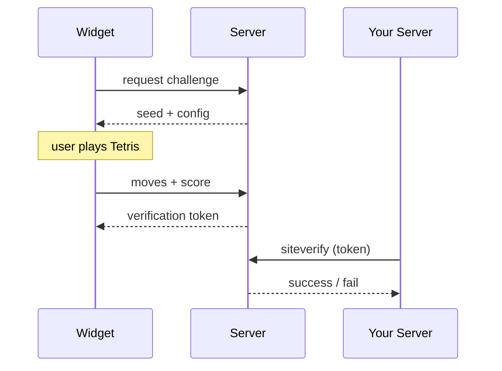

<pre>
⠀⠀⠀⠀⠀⠀⠀⠀⠀⠀⠀⠀⠀⠀⣠⣄⠀⠀⠀⠀⠀⠀⠀⠀⠀⠀⠀⠀⠀⠀
⠀⠀⠀⠀⠀⠀⠀⠀⠀⠀⠀⣀⣴⣾⣿⣿⣷⣦⣀⠀⠀⠀⠀⠀⠀⠀⠀⠀⠀⠀
⠀⠀⠀⠀⠀⠀⣤⣤⣶⣾⣿⣿⣿⣿⣿⣿⣿⣿⣿⣿⣷⣶⣤⣤⠀⠀⠀⠀⠀⠀
⠀⠀⠀⠀⠀⠀⣿⣿⣿⣿⣿⣿⣿⣿⣿⣿⣿⣿⣿⣿⣿⣿⣿⣿⠀⠀⠀⠀⠀⠀
⠀⠀⠀⠀⠀⠀⣿⣿⣿⣿⣿⣿⣿⣿⣿⣿⣿⣿⣿⣿⣿⣿⣿⣿⠀⠀⠀⠀⠀⠀
⠀⠀⠀⠀⠀⠀⣿⣿⣿⣿⣿⣿⣿⣿⣿⣿⣿⣿⣿⣿⣿⣿⣿⣿⠀⠀⠀⠀⠀⠀
⠀⠀⠀⠀⠀⠀⢹⣿⣿⣿⣿⣿⣿⣿⣿⣿⣿⣿⣿⣿⣿⣿⣿⡏⠀⠀⠀⠀⠀⠀
⠀⠀⠀⠀⠀⠀⠘⣿⣿⣿⣿⣿⣿⣿⣿⣿⣿⣿⣿⣿⣿⣿⣿⠃⠀⠀⠀⠀⠀⠀
⠀⠀⠀⠀⠀⠀⠀⢹⣿⣿⣿⣿⣿⣿⣿⣿⣿⣿⣿⣿⣿⣿⡏⠀⠀⠀⠀⠀⠀⠀
⠀⠀⠀⠀⠀⠀⠀⠀⢻⣿⣿⣿⣿⣿⣿⣿⣿⣿⣿⣿⣿⡟⠀⠀⠀⠀⠀⠀⠀⠀
⠀⠀⠀⠀⠀⠀⠀⠀⠀⠻⣿⣿⣿⣿⣿⣿⣿⣿⣿⣿⠟⠀⠀⠀⠀⠀⠀⠀⠀⠀
⠀⠀⠀⠀⠀⠀⠀⠀⠀⠀⠹⣿⣿⣿⣿⣿⣿⣿⣿⠏⠀⠀⠀⠀⠀⠀⠀⠀⠀⠀
⠀⠀⠀⠀⠀⠀⠀⠀⠀⠀⠀⠙⣿⣿⣿⣿⣿⣿⠋⠀⠀⠀⠀⠀⠀⠀⠀⠀⠀⠀
⠀⠀⠀⠀⠀⠀⠀⠀⠀⠀⠀⠀⠈⠻⣿⣿⠟⠁⠀⠀⠀⠀⠀⠀⠀⠀⠀⠀⠀⠀
⠀⠀⠀⠀⠀⠀⠀⠀⠀⠀⠀⠀⠀⠀⠙⠋⠀⠀⠀⠀⠀⠀⠀⠀⠀⠀⠀⠀⠀⠀
</pre>

# GameShield

A CAPTCHA alternative that replaces image puzzles with Tetris. Users prove they're human by playing a quick game — moves are verified server-side via deterministic replay.

## How it works



1. Widget requests a challenge — server returns a **seed** (determines piece sequence)
2. User plays Tetris, clears the required lines
3. Widget submits all **moves** back to the server
4. Server **replays the game deterministically** using the same seed and validates the result
5. Server issues a one-time **verification token**
6. Your backend verifies the token via `siteverify` (same pattern as reCAPTCHA/hCaptcha)

## Architecture

```
gameshield/
|-- apps/
|   |-- server/          # Hono API -- challenges, verification, analytics
|   +-- dashboard/       # React admin UI -- site management, analytics
|-- packages/
|   |-- widget/          # Lit web component -- <gameshield-captcha>
|   |-- server-sdk/      # Node.js SDK for server-side token verification
|   +-- shared/          # Shared TypeScript types
+-- docker/              # Docker Compose + nginx config
```

## Setup

```bash
git clone https://github.com/ComputelessComputer/gameshield.git
cd gameshield
pnpm install
pnpm dev          # starts server + dashboard + widget
pnpm setup        # creates a site and prints your keys
```

Output:

```
  SITE KEY (public, use in widget):
    gs_pk_abc123...

  SECRET KEY (private, use on your server):
    gs_sk_xyz789...
```

You can also pass a custom name and domain: `pnpm setup "My App" example.com`

## Usage

**Client** — drop the widget into any page:

```html
<gameshield-captcha site-key="gs_pk_..." api-url="https://your-api.com"></gameshield-captcha>
```

**Server** — verify the token:

```ts
import { GameShield } from '@gameshield/server-sdk';

const gs = new GameShield({
  siteKey: 'gs_pk_...',
  secretKey: 'gs_sk_...',
});

const result = await gs.verify(token);
if (result.success) {
  // human confirmed
}
```
